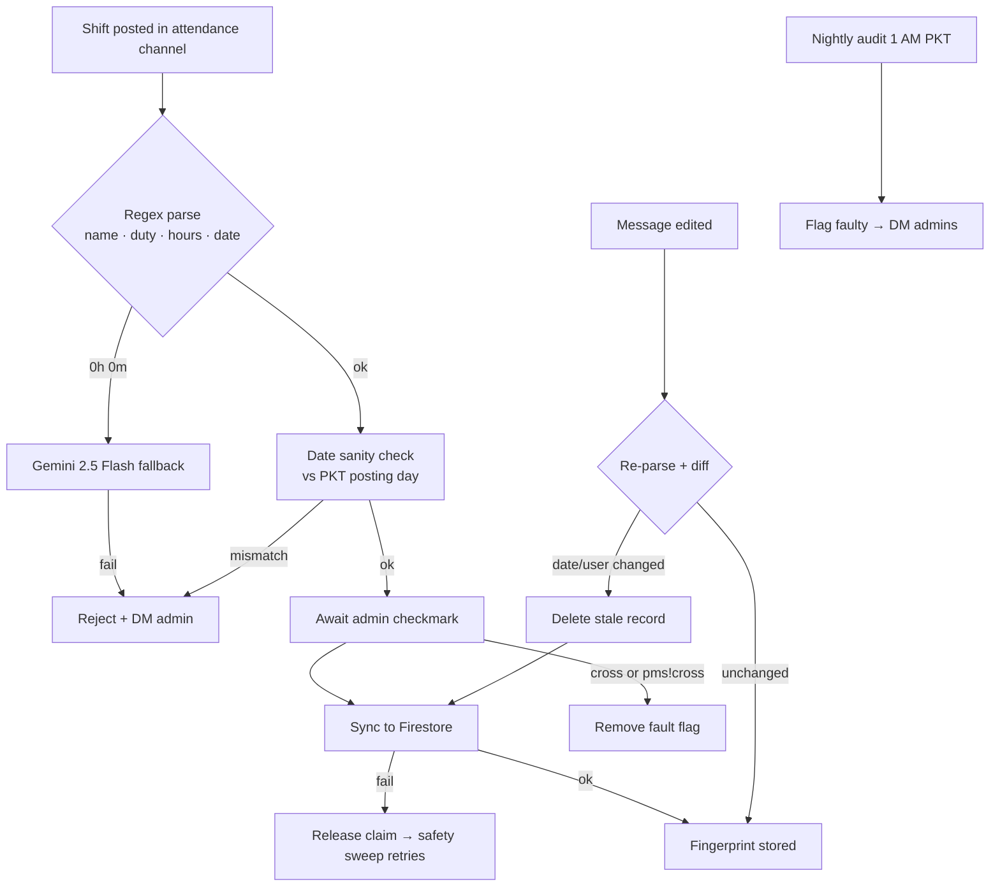

<div align="center">


# EMS Portal + PMS Selfbot

**A staff-management platform for an Emergency Medical Services community, paired with an autonomous Discord selfbot that turns roleplay attendance into verified records.**

A static-first web portal (vanilla JS + Firestore) handles administration. A Python selfbot watches the Discord attendance channel, validates every shift, syncs approved records to Firebase, audits them nightly, and generates weekly Google Sheets reports.

</div>

---

## Table of Contents

- [What It Does](#what-it-does)
- [Architecture](#architecture)
- [Attendance Pipeline](#attendance-pipeline)
- [Selfbot Commands](#selfbot-commands)
- [Repository Layout](#repository-layout)
- [Setup](#setup)
- [Deployment](#deployment)
- [Security Notes](#security-notes)
- [Credits](#credits)

## What It Does

**Web portal** (`index.html`, `dashboard.html`, `admin.html`, `auth.js`, `firebase-config.js`)

| Module | Description |
|---|---|
| Landing | Role selector — staff or admin sign-in |
| Staff dashboard | Attendance grid, bonuses and strikes, rules, training (trainers can manage training content) |
| Admin panel | Doctors and sub-admins, attendance, bonuses, strikes, rules, training, and a live selfbot console |
| Auth | Firestore-backed login, tab-scoped sessions with optional 10-day "remember me" |

**Selfbot** (`selfbot/`)

| Capability | How |
|---|---|
| Attendance capture | Parses posted shift messages via regex, falls back to **Gemini 2.5 Flash** when parsing returns zero |
| Verification | An admin's checkmark approval triggers the sync; malformed dates and impossible hours are rejected and reported back by DM |
| Self-healing | Dedicated blocking-call thread pool with hard deadlines, loop heartbeats, and a watchdog that hard-restarts a wedged process |
| Reliability | A safety sweep re-scans recent messages so a failed Firestore write is retried instead of lost; message edits re-sync and delete stale records |
| Nightly audit | 1 AM PKT job flags missing AM/PM duty times and written-date vs posting-day mismatches, then DMs admins |
| Weekly reports | `pms!sheet` clones a Google Sheets template tab and auto-fills every doctor's hours for the week |
| Live console | All bot logs stream to Firestore and render in the admin panel, gated by a token |

## Architecture

```
┌─────────────────────────┐        ┌──────────────────────────┐
│       Discord           │        │      EMS Web Portal      │
│  attendance channel     │        │  (static HTML + auth.js) │
└───────────┬─────────────┘        └────────────┬─────────────┘
            │ admin ✅                          │ Firebase JS SDK
            ▼                                   ▼
┌─────────────────────────────────────────────────────────────┐
│                      PMS Selfbot (Python)                   │
│  parse → validate → sync    ·    audit · sheets · watchdog  │
└───────────┬──────────────────────────────┬──────────────────┘
            │ Admin SDK                    │ gspread
            ▼                              ▼
┌─────────────────────────┐        ┌──────────────────────────┐
│      Google Firestore   │        │     Google Sheets        │
│  doctors · attendance · │        │  weekly attendance       │
│  bonuses · strikes ·    │        │  reports (template tab)  │
│  config · live logs     │        └──────────────────────────┘
└─────────────────────────┘
```

## Attendance Pipeline



## Selfbot Commands

Issued by DM from a managed bot admin (`bot_config/discord_admins`, seeded once, then managed from the master panel — refreshed every 60 s).

| Command | Action |
|---|---|
| `pms!sheet` / `pms!sheet --current` | Generate weekly sheet for last completed / current week |
| `pms!check` | Audit yesterday's attendances, DM the faulty list |
| `pms!cross <id>` | Remove the fault flag from a message |
| `pms!syncnames` | Re-sync portal names from Discord nicknames (`BADGE \| Name`) |
| `pms!logs` | Last 100 log lines |
| `pms!diag` | Health check — admins, heartbeats, recent reactions |
| `pms!restart` | Restart the selfbot process |

## Repository Layout

```
├── index.html · login.html · dashboard.html · admin.html · logs.html
├── auth.js              # Firebase auth + session + CRUD helpers
├── firebase-config.js   # Local only (gitignored) — copy from .example
├── ems_firestore.rules  # Production Firestore security rules
├── styles.css           # Design system (Apple-style reference, dark/light)
└── selfbot/
    ├── main.py          # Entry point — web server + bot threads
    ├── selfbot.py       # Listeners, commands, watchdog, sweep
    ├── firebase_sync.py # Firestore access (Admin SDK, deadlines)
    ├── sheet_sync.py    # Weekly Google Sheets generator
    ├── attendance_audit.py
    ├── console_log.py   # Live log mirror → Firestore
    └── web.py           # Flask server that serves the portal
```

## Setup

**Portal**

```bash
cp firebase-config.example.js firebase-config.js   # then fill in your Firebase web config
python selfbot/main.py                             # serves the portal + starts the bot
```

**Selfbot** — provide credentials either in `selfbot/config.json` (local) or environment variables (hosting):

| Variable | Purpose |
|---|---|
| `DISCORD_TOKEN` | User token for the selfbot |
| `GUILD_ID` / `CHANNEL_ID` | Attendance server / channel |
| `FIREBASE_PROJECT_ID` | Firestore project |
| `SERVICE_ACCOUNT_JSON` | Service account key JSON (Firebase Admin + Sheets) |
| `GEMINI_API_KEY` | Optional — enables the parsing fallback |

```bash
cd selfbot
pip install -r requirements.txt
python main.py
```

## Deployment

Designed for Railway-style hosting: `selfbot/Procfile` launches `python main.py`, and all secrets are supplied as environment variables. Locally, `config.json` and `serviceaccountkey.json` are used instead and are gitignored.

## Security Notes

- Credentials (`config.json`, `serviceaccountkey.json`, `firebase-config.js`) are gitignored — history has been scrubbed; never commit them.
- Firestore rules default-deny; see `ems_firestore.rules`. Note that doctor/admin passwords are compared client-side — acceptable for this deployment's threat model, but worth hardening for anything beyond it.
- Rotate any token that may have been exposed in past clones or forks.

## Credits

- **Engineering & product design** — [**Irtasam**](https://github.com/iamirtasam): the architecture, workflows, data model, and every design decision originated here. The problem-solving and thinking behind how this system works are entirely his.
- **Code production** — built with AI assistance under Irtasam's direction and review.
